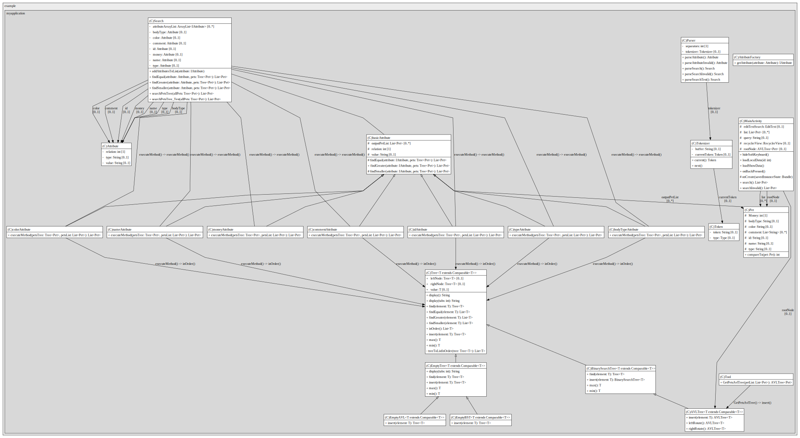
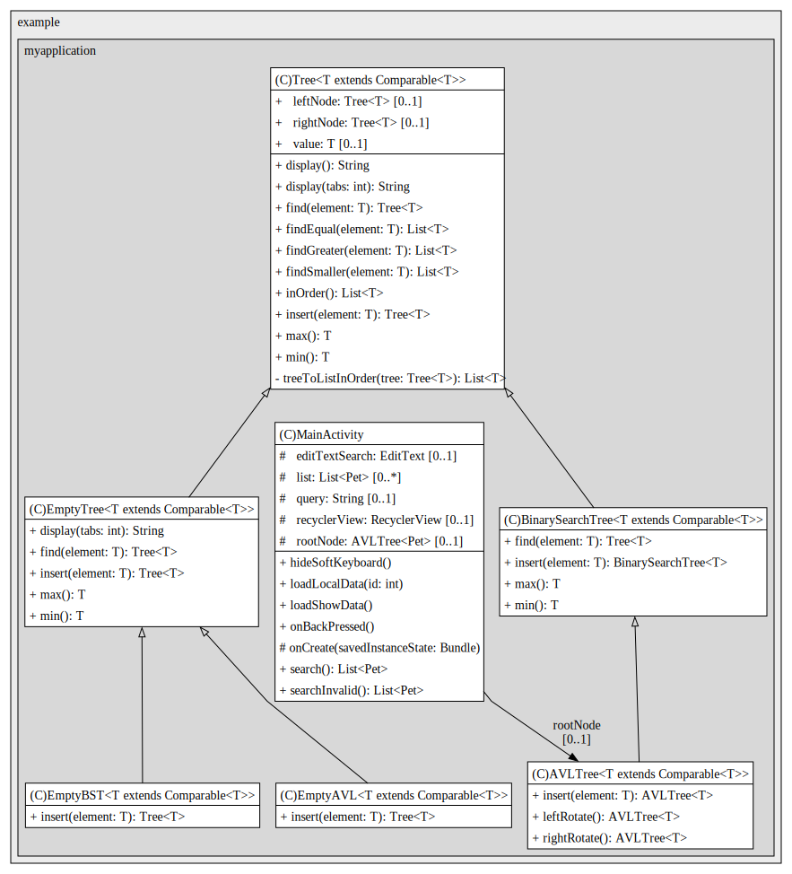

# G21 Report

The following is a report template to help your team successfully provide all the details necessary for your report in a structured and organised manner. Please give a straightforward and concise report that best demonstrates your project. Note that a good report will give a better impression of your project to the reviewers.

Note that you should have removed ALL TEMPLATE/INSTRUCTION textes in your submission (like the current sentence), otherwise it hampers the professionality in your documentation.

*Here are some tips to write a good report:*

* `Bullet points` are allowed and strongly encouraged for this report. Try to summarise and list the highlights of your project (rather than give long paragraphs).*

* *Try to create `diagrams` for parts that could greatly benefit from it.*

* *Try to make your report `well structured`, which is easier for the reviewers to capture the necessary information.*

*We give instructions enclosed in square brackets [...] and examples for each sections to demonstrate what are expected for your project report. Note that they only provide part of the skeleton and your description should be more content-rich. Quick references about markdown by [CommonMark](https://commonmark.org/help/)*

## Table of Contents

1. [Team Members and Roles](#team-members-and-roles)
2. [Summary of Individual Contributions](#summary-of-individual-contributions)
3. [Application Description](#application-description)
4. [Application UML](#application-uml)
5. [Application Design and Decisions](#application-design-and-decisions)
6. [Summary of Known Errors and Bugs](#summary-of-known-errors-and-bugs)
7. [Testing Summary](#testing-summary)
8. [Implemented Features](#implemented-features)
9. [Team Meetings](#team-meetings)
10. [Conflict Resolution Protocol](#conflict-resolution-protocol)

## Administrative
- Firebase Repository Link: <insert-link-to-firebase-repository>
   - Confirm: I have already added comp21006442@gmail.com as a Developer to the Firebase project prior to due date.
- Two user accounts for markers' access are usable on the app's APK (do not change the username and password unless there are exceptional circumstances. Note that they are not real e-mail addresses in use):
   - Username: comp2100@anu.edu.au	Password: comp2100
   - Username: comp6442@anu.edu.au	Password: comp6442

## Team Members and Roles
The key area(s) of responsibilities for each member

| UID      | Name          | Role           |
|:---------|:--------------|:---------------|
| u7605165 | Hexuan Meng   | Algorithm      |
| u7568823 | Fan Yue       | Design Pattern |
| u7758372 | Jiasheng Li   | Android        |
| u7580614 | Zhining Zhang | Front End      |

## Summary of Individual Contributions

Specific details of individual contribution of each member to the project.

Each team member is responsible for writing **their own subsection**.

A generic summary will not be acceptable and may result in a significant lose of marks.

*[Summarise the contributions made by each member to the project, e.g. code implementation, code design, UI design, report writing, etc.]*

*[Code Implementation. Which features did you implement? Which classes or methods was each member involved in? Provide an approximate proportion in pecentage of the contribution of each member to the whole code implementation, e.g. 30%.]*

*you should ALSO provide links to the specified classes and/or functions*
Note that the core criteria of contribution is based on `code contribution` (the technical developing of the App).

*Here is an example: (Note that you should remove the entire section (e.g. "others") if it is not applicable)*

1. **UID1, Name1**  I have 30% contribution, as follows:  
  - **Code Contribution in the final App**
    - Feature A1, A2, A3 - class Dummy: [Dummy.java](https://gitlab.cecs.anu.edu.au/comp2100/group-project/ga-23s2/-/blob/main/items/media/_examples/Dummy.java)
    - XYZ Design Pattern -  class AnotherClass: [functionOne()](https://gitlab.cecs.anu.edu.au/comp2100/group-project/ga-23s2/-/blob/main/items/media/_examples/Dummy.java#L22-43), [function2()](the-URL)
    - ... (any other contribution in the code, including UI and data files) ... [Student class](../src/path/to/class/Student.java), ..., etc.*, [LanguageTranslator class](../src/path/to/class/LanguageTranslator.java): function1(), function2(), ...   

  - **Code and App Design** 
    - [What design patterns, data structures, did the involved member propose?]*
    - [UI Design. Specify what design did the involved member propose? What tools were used for the design?]*   

  - **Others**: (only if significant and significantly different from an "average contribution") 
    - [Report Writing?] [Slides preparation?]*
    - [You are welcome to provide anything that you consider as a contribution to the project or team.] e.g., APK, setups, firebase*   

2. **u7568823, Fan Yue**  I have 25% contribution, as follows:  
  - **Code Contribution in the final App**
     - [UnitTest for validation of  username and password format in local login](https://gitlab.cecs.anu.edu.au/u7758372/ga-23s2/-/blob/main/MyApplication/app/src/main/java/com/example/myapplication/tool/unitTest.java)
      - [Feature [DataFiles]  file  data_sample_8color.json ](https://gitlab.cecs.anu.edu.au/u7758372/ga-23s2/-/blob/main/MyApplication/app/src/main/res/raw/data_sample_8color.json)
       - Feature [Login] , locally checking  and custom feature [Data-Formats]: [class  LoginActivity , LocalCheckUserLoginInfo(). ](https://gitlab.cecs.anu.edu.au/u7758372/ga-23s2/-/blob/main/MyApplication/app/src/main/java/com/example/myapplication/LoginActivity.java#L71).
       [LoadLocalUserInfo() ](https://gitlab.cecs.anu.edu.au/u7758372/ga-23s2/-/blob/main/MyApplication/app/src/main/java/com/example/myapplication/LoginActivity.java#L158) . 
       [Class User](https://gitlab.cecs.anu.edu.au/u7758372/ga-23s2/-/blob/main/MyApplication/app/src/main/java/com/example/myapplication/User.java). 
       [File userdata.xml ](https://gitlab.cecs.anu.edu.au/u7758372/ga-23s2/-/blob/main/MyApplication/app/src/main/res/xml/userdata.xml)
      - Chain of responsibility Design pattern[class LoginActivity, CheckComplianceOfUserData ()](https://gitlab.cecs.anu.edu.au/u7758372/ga-23s2/-/blob/main/MyApplication/app/src/main/java/com/example/myapplication/LoginActivity.java#L101). 
   [class: CheckingHandlerDemo ](https://gitlab.cecs.anu.edu.au/u7758372/ga-23s2/-/blob/main/MyApplication/app/src/main/java/com/example/myapplication/tool/CheckingHandler/CheckingHandlerDemo.java). 
   [class: AbstractCheckingHandler](https://gitlab.cecs.anu.edu.au/u7758372/ga-23s2/-/blob/main/MyApplication/app/src/main/java/com/example/myapplication/Interface/AbstractCheckingHandler.java). 
   [Class EmailFormatCheckingHandler](https://gitlab.cecs.anu.edu.au/u7758372/ga-23s2/-/blob/main/MyApplication/app/src/main/java/com/example/myapplication/tool/CheckingHandler/EmailFormatCheckingHandler.java). 
   [Class PasswordLengthCheckingHandler](https://gitlab.cecs.anu.edu.au/u7758372/ga-23s2/-/blob/main/MyApplication/app/src/main/java/com/example/myapplication/tool/CheckingHandler/PasswordCheckingHandler.java). 
   [Class PasswordCheckingHandler](https://gitlab.cecs.anu.edu.au/u7758372/ga-23s2/-/blob/main/MyApplication/app/src/main/java/com/example/myapplication/tool/CheckingHandler/PasswordLengthCheckingHandler.java) 
    -	Factory Method design pattern[Class AttributeFactory ](https://gitlab.cecs.anu.edu.au/u7758372/ga-23s2/-/blob/main/MyApplication/app/src/main/java/com/example/myapplication/Parser/AttributeFolder/AttributeFactory.java), 
     [Class Parser , part of parseSearchTest()](https://gitlab.cecs.anu.edu.au/u7758372/ga-23s2/-/blob/main/MyApplication/app/src/main/java/com/example/myapplication/Parser/Parser.java#L74). 
     [Class AttributeTypeEnum](https://gitlab.cecs.anu.edu.au/u7758372/ga-23s2/-/blob/main/MyApplication/app/src/main/java/com/example/myapplication/tool/AttributeTypeEnum.java) 
    -	Strategy design pattern  pattern .[Class Search, searchPetsTree_Test ()](https://gitlab.cecs.anu.edu.au/u7758372/ga-23s2/-/blob/main/MyApplication/app/src/main/java/com/example/myapplication/Parser/Search.java#L370) 
   [Class basicAttribute , excluding thr function of findEqual (),findSmaller (), and findGreater()](https://gitlab.cecs.anu.edu.au/u7758372/ga-23s2/-/blob/main/MyApplication/app/src/main/java/com/example/myapplication/Parser/AttributeFolder/basicAttribute.java); 
[Class bodyTypeAttribute, exclude the detail in the function of executeMethod()](https://gitlab.cecs.anu.edu.au/u7758372/ga-23s2/-/blob/main/MyApplication/app/src/main/java/com/example/myapplication/Parser/AttributeFolder/bodyTypeAttribute.java) 
[class colorAttribute , exclude the detail in function of executeMethod (). ](https://gitlab.cecs.anu.edu.au/u7758372/ga-23s2/-/blob/main/MyApplication/app/src/main/java/com/example/myapplication/Parser/AttributeFolder/colorAttribute.java) 
[class  colorAttribute , exclude the detail in function of executeMethod ().](https://gitlab.cecs.anu.edu.au/u7758372/ga-23s2/-/blob/main/MyApplication/app/src/main/java/com/example/myapplication/Parser/AttributeFolder/colorAttribute.java) 
[Class  commentAttribute , exclude the detail in function of executeMethod (). ](https://gitlab.cecs.anu.edu.au/u7758372/ga-23s2/-/blob/main/MyApplication/app/src/main/java/com/example/myapplication/Parser/AttributeFolder/commentAttribute.java) 
[Class idAttribute , exclude the detail in function of executeMethod ().](https://gitlab.cecs.anu.edu.au/u7758372/ga-23s2/-/blob/main/MyApplication/app/src/main/java/com/example/myapplication/Parser/AttributeFolder/idAttribute.java ) 
[Class moneyAttribute , exclude the detail in function of executeMethod (). ](https://gitlab.cecs.anu.edu.au/u7758372/ga-23s2/-/blob/main/MyApplication/app/src/main/java/com/example/myapplication/Parser/AttributeFolder/moneyAttribute.java) 
[Class nameAttribute , exclude the detail in function of executeMethod (). ](https://gitlab.cecs.anu.edu.au/u7758372/ga-23s2/-/blob/main/MyApplication/app/src/main/java/com/example/myapplication/Parser/AttributeFolder/nameAttribute.java) 
[ class  typeAttribute , exclude the detail in function of executeMethod ().](https://gitlab.cecs.anu.edu.au/u7758372/ga-23s2/-/blob/main/MyApplication/app/src/main/java/com/example/myapplication/Parser/AttributeFolder/typeAttribute.java) 
    - Part of AVL tree. [class pet , compareTo() ](https://gitlab.cecs.anu.edu.au/u7758372/ga-23s2/-/blob/main/MyApplication/app/src/main/java/com/example/myapplication/Pet.java#L48). 
     [Class Tool , GetPetsAvlTree()](https://gitlab.cecs.anu.edu.au/u7758372/ga-23s2/-/blob/main/MyApplication/app/src/main/java/com/example/myapplication/tool/Tool.java#L58) 

  
3. **u7758372, Jiasheng Li**  I have 25% contribution, as follows:  
- **Code Contribution in the final App**
    - Feature [LogIn], [LoadShowData], [FB-Auth], [FB-Persist], [Surprised Feature 2]
      - class LoginActivity: [login()](https://gitlab.cecs.anu.edu.au/u7758372/ga-23s2/-/blob/main/MyApplication/app/src/main/java/com/example/myapplication/LoginActivity.java#L57-100), [register()](https://gitlab.cecs.anu.edu.au/u7758372/ga-23s2/-/blob/main/MyApplication/app/src/main/java/com/example/myapplication/LoginActivity.java#L102-134).
      - class MainActivity: [loadShowData()](https://gitlab.cecs.anu.edu.au/u7758372/ga-23s2/-/blob/main/MyApplication/app/src/main/java/com/example/myapplication/MainActivity.java#L89-109), [updateDataFromFirebase()](https://gitlab.cecs.anu.edu.au/u7758372/ga-23s2/-/blob/main/MyApplication/app/src/main/java/com/example/myapplication/MainActivity.java#L144-167), [onBackPressed()](https://gitlab.cecs.anu.edu.au/u7758372/ga-23s2/-/blob/main/MyApplication/app/src/main/java/com/example/myapplication/MainActivity.java#L169-183)
      - class SearchActivity: [onActivityResult()](https://gitlab.cecs.anu.edu.au/u7758372/ga-23s2/-/blob/main/MyApplication/app/src/main/java/com/example/myapplication/SearchActivity.java#L85-120) 
    - [Pet class](https://gitlab.cecs.anu.edu.au/u7758372/ga-23s2/-/blob/main/MyApplication/app/src/main/java/com/example/myapplication/Pet.java), [DetailActivity class](https://gitlab.cecs.anu.edu.au/u7758372/ga-23s2/-/blob/main/MyApplication/app/src/main/java/com/example/myapplication/DetailActivity.java), [MyAdapter class](https://gitlab.cecs.anu.edu.au/u7758372/ga-23s2/-/blob/main/MyApplication/app/src/main/java/com/example/myapplication/MyAdapter.java),
    - SearchActivity class: [putToSearch()](https://gitlab.cecs.anu.edu.au/u7758372/ga-23s2/-/blob/main/MyApplication/app/src/main/java/com/example/myapplication/SearchActivity.java#L38-52), [constructQuery()](https://gitlab.cecs.anu.edu.au/u7758372/ga-23s2/-/blob/main/MyApplication/app/src/main/java/com/example/myapplication/SearchActivity.java#L54-83),
    - MainActivity class: [loadLocalData()](https://gitlab.cecs.anu.edu.au/u7758372/ga-23s2/-/blob/main/MyApplication/app/src/main/java/com/example/myapplication/MainActivity.java#L111-142), [hideSoftKeyboard()](https://gitlab.cecs.anu.edu.au/u7758372/ga-23s2/-/blob/main/MyApplication/app/src/main/java/com/example/myapplication/MainActivity.java#L185-195).

- **Code and App Design**
  - UML Class diagrams 
  - Construct UI prototype for SearchActivity, MainActivity and DetailActivity

- **Others**:
    - [Report Writing?] [Slides preparation?]*
    - Firebase project setup: https://console.firebase.google.com/u/1/project/petconnect-2ea29/overview
        * Account Number: comp2100.6442.g21@gmail.com Password: comp.G21!
    - APK generating
    - Android project setup and demo
    - Git repo setup and management
    - Team management

  
## Application Description

Our application PetConnect is designed for pet adoption. PetConnect provides convenient, customized services for caring pet adopters.
Adopters can find their best-fit pets by PetConnect based on their favorite pet type, coat color, and body type.
PetConnect also provides an estimated adoption budget and comments from other users for adopters to refer to.

We believe that our design of PetConnect which takes into account the individual needs and abilities of adopters can significantly improve the adoption rate and quality of poor pets.

### Application Use Cases and or Examples

1. Target Users: Adopters who have preferences for pet characteristics
   * Users can search for pets based on criteria such as pet type (e.g., dog, cat, rabbit), coat color, and body type (e.g., small, medium, large).
   * Users can search and browse comments to get additional information about pets.
   * The application will provide a list of pets that match the user's preferences, helping them find their best-fit pet.

2. Target Users: Adopters with limited financial means
   * Users can set a budget and receive recommendations within their specified limits.
   * PetConnect offers a feature to estimate the adoption budget, which considers factors like the pet's breed, age, and expected ongoing costs (e.g., food, veterinary care).

3. Target Users: Owners of their lost pets
   * Users can find their pets by searching pets' names, characteristics or any information about missing.

4. Target Users: Investors (e.g., herdsman, zoo, working animal training center, etc).
   * Users can look for the animals they need based on searching characteristics and comments and observing the photos

 

### Application UML
#### UML Class diagram of the whole application
  
#### UML Class diagram of Login and Sign up process
  
#### UML Class diagram of AVL Tree implementation
  

## Application Design and Decisions

This is an important section of your report and should include all technical decisions made. Well-written justifications will increase your marks for both the report as well as for the relevant parts (e.g., data structure). This includes, for example,

- Details about the parser (describe the formal grammar and language used)

- Decisions made (e.g., explain why you chose one or another data structure, why you used a specific data model, etc.)

- Details about the design patterns used (where in the code, justification of the choice, etc)

*Please give clear and concise descriptions for each subsections of this part. It would be better to list all the concrete items for each subsection and give no more than `5` concise, crucial reasons of your design.

### Data Structures

*I used the following data structures in my project:*

1. *AVL tree*
   * *Objective: used for storing pets for [Search] feature.*
   * *Code Locations: defined in [Class AVLTree](https://gitlab.cecs.anu.edu.au/u7758372/ga-23s2/-/blob/main/MyApplication/app/src/main/java/com/example/myapplication/AVLTree/AVLTree.java)*
   * *Reasons:*
      * *Dynamic Operations* 
      It is more efficient than Red-black tree for searching with a time complexity O(log n).We don't need to often insert items into the tree, so the performance of insertion is not as important as searching.
      * *Balanced Binary Search Trees*  
      AVL trees are a type of self-balancing binary search tree. Every insertion operation ensures that the tree remains balanced, which means the height of the tree is always maintained at `O(log n)`. This ensures that search operations are fast and have a time complexity of `O(log n)` and is much better than many sorting algorithms that might require O(n) space..
      * *In-Order Traversal Efficiency*:  
      there's a need in our application to retrieve data in a sorted manner (e.g., display all pets in money-descending order), AVL trees allow efficient in-order traversal.
      * *Memory Usage*:  
      Unlike Hash Maps or Hash Tables which might use arrays and linked lists with additional overhead for handling collisions, AVL trees use a simple node-based structure. Each node in the AVL tree typically contains the data, a height (integer), and pointers to left and right children. This can lead to efficient memory usage.

### Design Patterns

1. *Chain of responsibility Design Pattern*
   * *Objective:* used for validate the format of username and password in Login function.
   * *Code Locations:* defined in [Class LoginActivity, CheckComplianceOfUserData () ](https://gitlab.cecs.anu.edu.au/u7758372/ga-23s2/-/blob/main/MyApplication/app/src/main/java/com/example/myapplication/LoginActivity.java#L164)
and proceed in [class: CheckingHandlerDemo ](https://gitlab.cecs.anu.edu.au/u7758372/ga-23s2/-/blob/main/MyApplication/app/src/main/java/com/example/myapplication/tool/CheckingHandler/CheckingHandlerDemo.java); 
[class: AbstractCheckingHandler ](https://gitlab.cecs.anu.edu.au/u7758372/ga-23s2/-/blob/main/MyApplication/app/src/main/java/com/example/myapplication/Interface/AbstractCheckingHandler.java) and [Class EmailFormatCheckingHandler](https://gitlab.cecs.anu.edu.au/u7758372/ga-23s2/-/blob/main/MyApplication/app/src/main/java/com/example/myapplication/tool/CheckingHandler/EmailFormatCheckingHandler.java) , 
[Class PasswordLengthCheckingHandler ](https://gitlab.cecs.anu.edu.au/u7758372/ga-23s2/-/blob/main/MyApplication/app/src/main/java/com/example/myapplication/tool/CheckingHandler/PasswordCheckingHandler.java) ,
[Class PasswordCheckingHandler](https://gitlab.cecs.anu.edu.au/u7758372/ga-23s2/-/blob/main/MyApplication/app/src/main/java/com/example/myapplication/tool/CheckingHandler/PasswordLengthCheckingHandler.java)
   * *Reasons:*
      * Modularity: The system can be made more modular by encapsulating each check (such as email format, password length, password format, etc.) in a separate class or module. Without changing the current code, we could quickly add a new link in the chain if a new validation requirement arose. 
      * Flexibility:Simply rearranging the chain's links will result in a new order for the checks. For example, we only need to rearrange the links if we choose to verify the strength of the password before the email format.
      * Maintainability:In the event that a specific validation logic needs to be modified in the future, we just need to update that link in the chain; the other checks remain unchanged.
      * Decoupling:The pattern separates the receivers—the individual validation checks—from the sender, which in this case is the portion of our app that initiates the login validation. The system's constituent parts can remain independent and cohesive thanks to this decoupling. 
      * Stop On Failure:The chain can be stopped as soon as one of the validators fails, depending on how we implement it. This can be effective because, once a failure is identified, it won't call upon additional validators needlessly. 

1. *Factory Method Design Pattern*
   * *Objective:* used for create a specified filter-attribute regarding the input-query.
   * *Code Locations:*defined in [Class AttributeFactory](https://gitlab.cecs.anu.edu.au/u7758372/ga-23s2/-/blob/main/MyApplication/app/src/main/java/com/example/myapplication/Parser/AttributeFolder/AttributeFactory.java);
and proceed in  [class: Parser , part of parseSearchTest()](https://gitlab.cecs.anu.edu.au/u7758372/ga-23s2/-/blob/main/MyApplication/app/src/main/java/com/example/myapplication/Parser/Parser.java#L74);
[class: AbstractCheckingHandler ](https://gitlab.cecs.anu.edu.au/u7758372/ga-23s2/-/blob/main/MyApplication/app/src/main/java/com/example/myapplication/Interface/AbstractCheckingHandler.java);
[Class AttributeTypeEnum ](https://gitlab.cecs.anu.edu.au/u7758372/ga-23s2/-/blob/main/MyApplication/app/src/main/java/com/example/myapplication/tool/AttributeTypeEnum.java)
   * *Reasons:*
      * Variability in Attribute Types: A factory can assist in creating the appropriate kind of attribute based on the query input if we anticipate having many more attribute types in the future than just "money" and "color." 
      * Complex Creation Logic: Coding can become cleaner and easier to maintain if an attribute creation process (such as initializing related data structures, setting default values, etc.) is complex and is contained within a factory.
      * Extensibility:We may add more features as our app develops. We can easily expand our attribute creation process with the aid of a factory method. 

3. *Strategy Design Pattern*
   * *Objective:* used for filter the data sample with different logic.
   * *Code Locations:* [Class Search, searchPetsTree_Test ()](https://gitlab.cecs.anu.edu.au/u7758372/ga-23s2/-/blob/main/MyApplication/app/src/main/java/com/example/myapplication/Parser/Search.java#L370);
defined in [Class IAttribute](https://gitlab.cecs.anu.edu.au/u7758372/ga-23s2/-/blob/main/MyApplication/app/src/main/java/com/example/myapplication/Interface/IAttribute.java);
and proceed in [Class basicAttribute , excluding thr function of findEqual (),findSmaller (), and findGreater()](https://gitlab.cecs.anu.edu.au/u7758372/ga-23s2/-/blob/main/MyApplication/app/src/main/java/com/example/myapplication/Parser/AttributeFolder/basicAttribute.java);
[Class bodyTypeAttribute, exclude the detail in the function of executeMethod()](https://gitlab.cecs.anu.edu.au/u7758372/ga-23s2/-/blob/main/MyApplication/app/src/main/java/com/example/myapplication/Parser/AttributeFolder/bodyTypeAttribute.java)
[class colorAttribute , exclude the detail in function of executeMethod (). ](https://gitlab.cecs.anu.edu.au/u7758372/ga-23s2/-/blob/main/MyApplication/app/src/main/java/com/example/myapplication/Parser/AttributeFolder/colorAttribute.java)
[class  colorAttribute , exclude the detail in function of executeMethod ().](https://gitlab.cecs.anu.edu.au/u7758372/ga-23s2/-/blob/main/MyApplication/app/src/main/java/com/example/myapplication/Parser/AttributeFolder/colorAttribute.java)
[Class  commentAttribute , exclude the detail in function of executeMethod (). ](https://gitlab.cecs.anu.edu.au/u7758372/ga-23s2/-/blob/main/MyApplication/app/src/main/java/com/example/myapplication/Parser/AttributeFolder/commentAttribute.java)
[Class idAttribute , exclude the detail in function of executeMethod ().](https://gitlab.cecs.anu.edu.au/u7758372/ga-23s2/-/blob/main/MyApplication/app/src/main/java/com/example/myapplication/Parser/AttributeFolder/idAttribute.java )
[Class moneyAttribute , exclude the detail in function of executeMethod (). ](https://gitlab.cecs.anu.edu.au/u7758372/ga-23s2/-/blob/main/MyApplication/app/src/main/java/com/example/myapplication/Parser/AttributeFolder/moneyAttribute.java)
[Class nameAttribute , exclude the detail in function of executeMethod (). ](https://gitlab.cecs.anu.edu.au/u7758372/ga-23s2/-/blob/main/MyApplication/app/src/main/java/com/example/myapplication/Parser/AttributeFolder/nameAttribute.java)
[ class  typeAttribute , exclude the detail in function of executeMethod ().](https://gitlab.cecs.anu.edu.au/u7758372/ga-23s2/-/blob/main/MyApplication/app/src/main/java/com/example/myapplication/Parser/AttributeFolder/typeAttribute.java)
   * *Reasons:*
      * Encapsulation of Filtering Logic: Every filtering criterion (like money or color) can be contained within a separate class. This makes the codebase clean and organized by guaranteeing that the logic for each criterion is isolated. 
      * Flexibility in Filtering: Future filtering criteria can be easily added with the Strategy pattern. We can simply add a new filtering strategy without changing the existing code if we later decide to filter based on another attribute, like "size" or "date." 
      * Dynamic Filter Selection:We can choose the best filtering strategy at runtime because the filtering logic is separated from the main application logic. For example, once the query has been parsed, we can use the user's input to dynamically instantiate and apply the required filter strategies. 
      * Maintainability and Extensibility:Because every strategy class is in charge of a particular kind of filtering, the Single Responsibility Principle is encouraged. It is now simpler to identify problems, update specific filter logic, and expand the system with additional filter types thanks to this separation.  
      * Testability: The decoupling and modularization of the filtering logic makes it simpler to write unit tests for every strategy. To make sure that every component of your filtering logic functions as intended, you can test each filtering criterion separately. 

### Parser

### <u>Grammar(s)</u>
We designed two grammars, the first one is more strict than the second.
   * *Reasons:*
      * We want our app to return accurate search results if the search input strictly follows our first grammar.
      * we also want it to accept a broader range of search inputs, and return the results based on the parts that can be recognized by our second grammar.

In conclusion, compared with only using one grammar, our design can accept more search inputs, and guarantee the correctness of search results without crashing our app. 

First grammar for normal search:

Production Rules:

    <Search> ::= (<Attribute> <separator>){0-6} <Attribute> | <>
    <Attribute> ::= <identifier> <operator> (<numeric literal> | <string literal>){0-1}

Second grammar for invalid search:

Production Rules:

    <Search> ::= <attribute>*
    <Attribute> ::= <identifier> <operator>{0-1} (<numeric literal> | <string literal>){0-1}

### <u>Tokenizers and Parsers</u>

*[Where do you use tokenisers and parsers? How are they built? What are the advantages of the designs?]*

### Others

*[What other design decisions have you made which you feel are relevant? Feel free to separate these into their own subheadings.]*

 

## Implemented Features

### Basic Features
1. [LogIn]. Users must be able to log in (not necessarily sign up). (easy)
   * Important: You must include the following two accounts for markers' access to your App:
     * Username: comp2100@anu.edu.au&emsp;Password: comp2100
     * Username: comp6442@anu.edu.au&emsp;Password: comp6442
   * Code: [Class LoginActivity, method login](https://gitlab.cecs.anu.edu.au/u7758372/ga-23s2/-/blob/main/MyApplication/app/src/main/java/com/example/myapplication/LoginActivity.java#L57-100) and [method register](https://gitlab.cecs.anu.edu.au/u7758372/ga-23s2/-/blob/main/MyApplication/app/src/main/java/com/example/myapplication/LoginActivity.java#L102-134)
   * Description of your implementation:
     * User will log in by:
         1. Firebase Authentication if network is available,
         2. Local user information if (a) fails, by method [LocalCheckUserLoginInfo](https://gitlab.cecs.anu.edu.au/u7758372/ga-23s2/-/blob/main/MyApplication/app/src/main/java/com/example/myapplication/LoginActivity.java#L136-148).
     * And this method will check if:
         1. Input is empty,
         2. Input is in right format, by method [CheckComplianceOfUserData](https://gitlab.cecs.anu.edu.au/u7758372/ga-23s2/-/blob/main/MyApplication/app/src/main/java/com/example/myapplication/LoginActivity.java#L150-159).
     * And will display the corresponding result messages by Toast if login fails.

2. [DataFiles] ,Create data file(s) with at least 2,500 valid data instances,
   * Code to the Data File ：[File  data_sample_8color.json](https://gitlab.cecs.anu.edu.au/u7758372/ga-23s2/-/blob/main/MyApplication/app/src/main/res/raw/data_sample_8color.json)

3. [LoadShowData]. When a user is logged in, load data (from the file(s) and/or Firebase) at regular time intervals,
   and visualise the same in the App.   (e.g., If the main page contains a list of featured products, the user may see
   an increased number of products;   as well as receive notifications from interactions simulated from the data
   stream). (medium)
   * Code: [Class MainActivity, method loadShowData](https://gitlab.cecs.anu.edu.au/u7758372/ga-23s2/-/blob/main/MyApplication/app/src/main/java/com/example/myapplication/MainActivity.java#L89-109)
   * Description of your implementation:
     * The application will load data and show:
       1. All the data if user doesn't input a query in SearchActivity,
       2. Search result if user inputs a query in SearchActivity.

4. [Search]. Users must be able to search for information on your app. (medium) 
   The application is dependent on your app theme. E.g., search for information of products, users, by certain
   criteria (e.g. #apple $1-2).
   * Code: [Class Search](https://gitlab.cecs.anu.edu.au/u7758372/ga-23s2/-/blob/main/MyApplication/app/src/main/java/com/example/myapplication/Parser/Search.java)
   * Description of feature: ...  
   * Description of your implementation: ...  

### Custom Features
Feature Category: Search-related features  
1. [Search-Invalid]. On top of giving search results from valid inputs, search functionality can process and  
correctly handle partially invalid search queries and give meaningful results. (medium)
   * Code: [Class Search](https://gitlab.cecs.anu.edu.au/u7758372/ga-23s2/-/blob/main/MyApplication/app/src/main/java/com/example/myapplication/Parser/Search.java)
   * Description of your implementation: ...

2. [Search-Filter]. Sort and filter a list of items returned from searches, with the use of suitable UI components. (easy)
   * Code: [Class X, entire file](https://gitlab.cecs.anu.edu.au/comp2100/group-project/ga-23s2/-/blob/main/items/media/_examples/Dummy.java#L22-43) and Class Y, ...
   * Description of your implementation: ...

  
Feature Category: UI Design and Testing  
1. [UI-Layout]. Incorporate suitable layout adjustments in the UI components for portrait and landscape layout variants, as well as different screen sizes. (easy)
   * Code: [Class X, entire file](https://gitlab.cecs.anu.edu.au/comp2100/group-project/ga-23s2/-/blob/main/items/media/_examples/Dummy.java#L22-43) and Class Y, ...
   * [Class B](../src/path/to/class/file.java#L30-85): methods A, B, C, lines of code: 30 to 85
   * Description of your implementation: ...

  
Feature Category: Greater Data Usage, Handling and Sophistication  
1. [Data-Formats]. Read data from local files in at least 2 different formats (JSON, XML, etc.). (easy)
    * Code:[Class LoginActivity , LocalCheckUserLoginInfo()](https://gitlab.cecs.anu.edu.au/u7758372/ga-23s2/-/blob/main/MyApplication/app/src/main/java/com/example/myapplication/LoginActivity.java#L71) and [LoadLocalUserInfo() ](https://gitlab.cecs.anu.edu.au/u7758372/ga-23s2/-/blob/main/MyApplication/app/src/main/java/com/example/myapplication/LoginActivity.java#L158), [Class User ](https://gitlab.cecs.anu.edu.au/u7758372/ga-23s2/-/blob/main/MyApplication/app/src/main/java/com/example/myapplication/User.java).
    [File userdata.xml](https://gitlab.cecs.anu.edu.au/u7758372/ga-23s2/-/blob/main/MyApplication/app/src/main/res/xml/userdata.xml).
    [File  data_sample_8color.json ](https://gitlab.cecs.anu.edu.au/u7758372/ga-23s2/-/blob/main/MyApplication/app/src/main/res/raw/data_sample_8color.json)
    * Description of your implementation: storing the data sample in json format  and storing the user’s username and password in xml format. The json used to get the datasample. And the xml used to checking the validation of the input information.

  
Feature Category: Firebase Integration  
1. [FB-Auth]. Use Firebase to implement User Authentication/Authorisation. (easy)
    * Code: [Class LoginActivity, method login](https://gitlab.cecs.anu.edu.au/u7758372/ga-23s2/-/blob/main/MyApplication/app/src/main/java/com/example/myapplication/LoginActivity.java#L57-100) and [method register](https://gitlab.cecs.anu.edu.au/u7758372/ga-23s2/-/blob/main/MyApplication/app/src/main/java/com/example/myapplication/LoginActivity.java#L102-134)
    * Description of your implementation:
      * User will log in or sign up by Firebase Authentication if network is available,
      * And will display the corresponding result messages by Toast if login or sign up fails.

2. [FB-Persist]. Use Firebase to persist all data used in your app. (medium)
   * Code: [Class MainActivity, method updateDataFromFirebase](https://gitlab.cecs.anu.edu.au/u7758372/ga-23s2/-/blob/main/MyApplication/app/src/main/java/com/example/myapplication/MainActivity.java#L144-167)
   * Description of your implementation:
     * Method to fetch latest data from Firebase when network is available,
     * Load local data instead when it's fetching because this task is asynchronous,
     * So once it's done, it will update the data loaded by application.

### Surprised Features

1. How to rank the items returned for a given search (a ranking algorithm);
   * Code: [Class AVLTree, method insert](https://gitlab.cecs.anu.edu.au/u7758372/ga-23s2/-/blob/main/MyApplication/app/src/main/java/com/example/myapplication/AVLTree/AVLTree.java#L35-67) and [Class Pet, method compareTo](https://gitlab.cecs.anu.edu.au/u7758372/ga-23s2/-/blob/main/MyApplication/app/src/main/java/com/example/myapplication/Pet.java#L49-52)
   * Explanations on solution:
       * All search results will be ranked depends on the cost of pets in our project, from low to high,
       * Because our application aims to 

2. Log previous searches and user information to improve search results;
   * Code: [Class SearchActivity, method onActivityResult](https://gitlab.cecs.anu.edu.au/u7758372/ga-23s2/-/blob/main/MyApplication/app/src/main/java/com/example/myapplication/SearchActivity.java#L85-120) and [Class MainActivity, method onBackPressed](https://gitlab.cecs.anu.edu.au/u7758372/ga-23s2/-/blob/main/MyApplication/app/src/main/java/com/example/myapplication/MainActivity.java#L169-183)
   * Explanations on solution:
     * Because of Android logic, information will lose in transferring between activities, especially returning from the next activity,
     * In our project, the query may not be updated in SearchActivity if users keep searching in MainActivity,
     * Thus, we want to return the last query from MainActivity to SearchActivity to maintain smooth user experiences.

3. A strategy for showing ads (promoted items);
   * Explanations on solution:
     * We have decided not to show ads at present for the following reasons:
       1. Showing ads early in the app's launch can give users a bad first impression.
       2. An application showing ads early in its launch is generally regarded as an **Adware**.
       3. As our application is for charity, we don't exploit poor displaced animals for profit.
     * However, if we are unable to keep running in the future, we may consider including a small amount of ads.

4. A new strategy for visualising the traditional list of results.
   * Not implemented.

  

## Summary of Known Errors and Bugs

*[Where are the known errors and bugs? What consequences might they lead to?]*
*List all the known errors and bugs here. If we find bugs/errors that your team does not know of, it shows that your testing is not thorough.*

*Here is an example:*

1. *Bug 1:*
   - *A space bar (' ') in the sign in email will crash the application.*
   - ...

2. *Bug 2:*
3. ...

  

## Testing Summary

*[What features have you tested? What is your testing coverage?]*
*Please provide some screenshots of your testing summary, showing the achieved testing coverage. Feel free to provide further details on your tests.*

*Here is an example:*

1. Tests for Search
   - Code: [TokenizerTest Class, entire file](https://gitlab.cecs.anu.edu.au/comp2100/group-project/ga-23s2/-/blob/main/items/media/_examples/Dummy.java) for the [Tokenizer Class, entire file](https://gitlab.cecs.anu.edu.au/comp2100/group-project/ga-23s2/-/blob/main/items/media/_examples/Dummy.java#L22-43)
   - *Number of test cases: ...*
   - *Code coverage: ...*
   - *Types of tests created and descriptions: ...*

2. Tests for the format-validation-method of username and password 

   - [unitTest  Class](https://gitlab.cecs.anu.edu.au/u7758372/ga-23s2/-/blob/main/MyApplication/app/src/main/java/com/example/myapplication/tool/unitTest.java) for the[CheckingHandlerDemo Class]( https://gitlab.cecs.anu.edu.au/u7758372/ga-23s2/-/blob/main/MyApplication/app/src/main/java/com/example/myapplication/tool/CheckingHandler/CheckingHandlerDemo.java).
   - Number of test cases:  6
   - Code coverage:100%
   - Types of tests created and descriptions:  
   test the format-validation-method of username and password. Wrong format will return relevant result. For instance, if the password is “123456678”, the test would return “the password should contain digitals and letters”

  

## Team Management

### Meetings Records
* Link to the minutes of your meetings like above. There must be at least 4 team meetings.
  (each commited within 2 days aftre the meeting)
* Your meetings should also have a reasonable date spanning across Week 6 to 11.*

- *[Team Meeting 1](meeting1.md)*
- ...
- ...
- [Team Meeting 4](link_to_md_file.md)
- ... (Add any descriptions if needed) ...

### Conflict Resolution Protocol
1. **Open Communication**:
- Encourage open and honest communication within the team. Team members should feel comfortable expressing concerns, ideas, and feedback.

2. **Define Clear Roles and Responsibilities**:
- Ensure that each team member understands their role and responsibilities. Clear job descriptions can help prevent conflicts arising from misunderstandings about who should do what.

3. **Regular Meetings**:
- Hold regular team meetings to discuss progress, challenges, and potential conflicts. These meetings can be daily stand-ups, weekly check-ins, or as needed.

4. **Documentation**:
- Keep thorough documentation of project requirements, design decisions, and coding standards. This documentation serves as a reference point to resolve disputes based on facts.

5. **Issue Tracking**:
- Use project management tools like JIRA, Trello, or Asana to track issues and feature requests. Ensure that every concern or feature request is documented, assigned, and tracked.

6. **Peer Review**:
- Implement a peer review process for code, design, and other project elements. Peer reviews can catch issues early and improve overall quality.

7. **Mediation**:
- Designate a mediator or team lead responsible for conflict resolution. When conflicts arise, team members can approach the mediator for assistance.

8. **Private Discussions**:
- When conflicts occur, encourage team members to have private, one-on-one discussions before involving the entire team. Often, issues can be resolved at this level.

9. **Conflict Resolution Meeting**:
- If a conflict persists, schedule a dedicated conflict resolution meeting. During this meeting:
    - Identify the root cause of the conflict.
    - Listen to all parties involved.
    - Brainstorm potential solutions.
    - Collaboratively agree on a resolution plan.
    - Assign responsibilities and set deadlines for implementing the solution.

10. **Escalation**:
- Define a clear escalation process for conflicts that cannot be resolved within the team. This might involve involving higher-level management or stakeholders.

11. **Follow-Up**:
- After implementing a resolution, follow up to ensure that the conflict has been resolved satisfactorily. Make adjustments if necessary.

12. **Learn and Improve**:
- After conflicts are resolved, conduct a post-mortem or lessons learned session to identify ways to prevent similar conflicts in the future.

13. **Positive Team Culture**:
- Foster a positive team culture that values collaboration, respect, and diversity of thought. A healthy team culture can preempt many conflicts.

14. **Training and Development**:
- Invest in training and professional development opportunities for team members to improve their skills and reduce conflicts stemming from knowledge gaps.

15. **Conflict Prevention**:
- Whenever possible, focus on preventing conflicts by establishing clear processes, standards, and expectations from the outset of the project.
